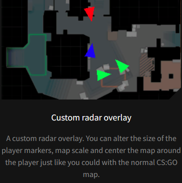
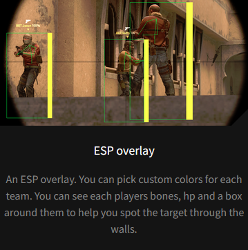
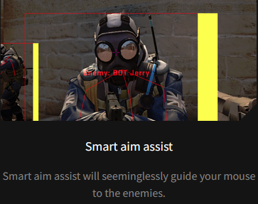

# CSV1

CSV1 is a learning project focused on creating a real-time data analysis and visualization system for a popular first-person shooter game. It explores techniques to extract live game data without modifying or interfering with the game's codebase.

### Features

- **Authentication**  
  The program is only directly accessible to authenticated users. Users authenticate via Firebase to gain access.

- **Radar**  
  

- **ESP (Extra Sensory Perception)**  
  

- **Aim assist**  
  

## Statically linked libraries
https://github.com/glfw/glfw

https://github.com/nigels-com/glew

https://github.com/firebase/firebase-cpp-sdk

https://github.com/g-truc/glm

https://github.com/ocornut/imgui

https://github.com/littlstar/soil

https://github.com/nothings/stb